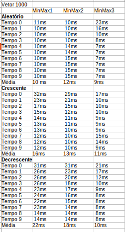
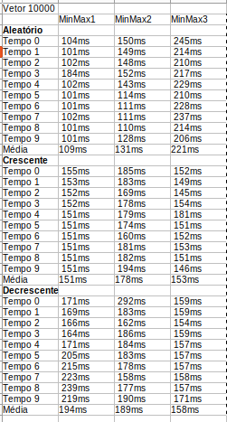
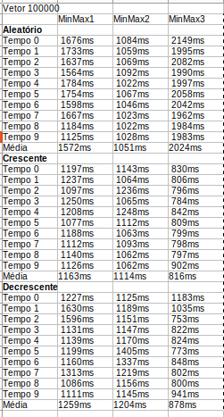
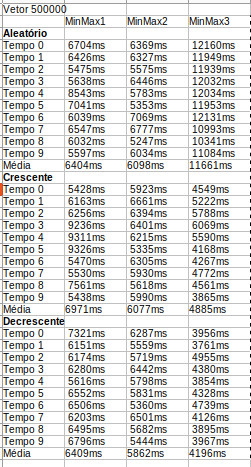
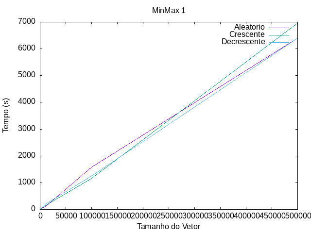
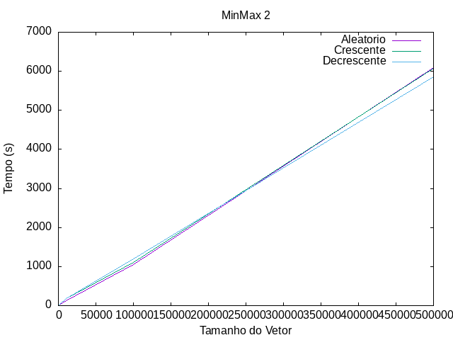
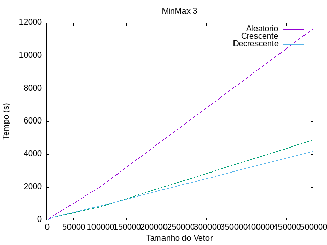

# MinMax

# Introdução

Em diversos campos da computação, a otimização do tempo de execução de algoritmos é uma questão crucial.Neste trabalho, foram criados três algoritmos diferentes(MinMax 1, MinMax2 e MinMax3), os quais exercem a mesma função, que é encontrar um valor máximo e mínimo dentro de um conjunto de números. Entretanto,cada um dos algoritmos foram implementados de diferentes maneiras e recebiam dados com diferentes tamanhos, com o intuito de verificar os impactos no tempo de execução que diferentes implementações podem ter com diferentes tamanhos de entrada. 

# Objetivos

Neste trabalho foram implementados 3 tipos diferentes de funções MinMax e criados 3 tipos de vetores(aleatório, crescente e decrescente), as funções recebiam os três tipos de vetores que variavam de tamanho. A diferença entre os tamanhos, tipo de função e tipo de vetor foram criados visando uma análise comparativa para melhor compreensão de como essas mudanças podem impactar no tempo de execução de um programa.

# Implementação

  - Main.cpp: A main foi utilizada para a chamada das funções da classe MinMax, bem como para a criação do vetores aleatório, crescente e decrescente. Esses vetores foram criados na main com o intutito das funções minmax 1, 2 e 3 utilizarem dos mesmos vetores para maior precisão. Na main também foi criado um vetor com os tamanhos, que foram percorridos por um for para variar o tamanho dos vetores criados.
  -MinMax.hpp:Contém a declaração das variáveis e funções envolvidas no processo.
  - MinMax.cpp: Na classe MinMax foram implementadas as funções Minmax, funções para ordenação, funções para contagem de tempo e para escrita em um arquivo .txt.

- void MinMax::Gerador_aleatorios(int *&vetor,int tamanho): Essa função gerava números aleatórios para serem utilizados no vetor aleatório e depois ordenados. Utilizou-se da função rand() para tal finalidade.
- void MinMax::ordena_crescente(int *vetor_aleatorio, int *&vetor_crescente, int tamanho): Essa função ordena o vetor aleatório e salva em um vetor crescente. Utilizou-se da função sort() para tal finalidade, pois se mostrou a mais veloz em termos de ordenação para maior agilidade de execução do programa.
- void MinMax::escrevearquivo(string nome_arquivo,int tamanho,int tempo_1,int tempo_2, int tempo_3): Essa função foi criada para salvar as médias dos tempos de execução em um arquivo .txt.

# MinMax 1

No primeiro algoritmo minmax 1 ao percorrer o vetor para encontrar o maior e o menor elemento, a função utiliza dois laços if para comparar cada elemento com os valores atuais de máximo e mínimo.    A função percorre o vetor a partir do segundo elemento até o último (i começa em 1 e vai até n - 1). Para cada elemento do vetor, a função verifica se ele é maior que o valor atual de max e se é menor que o valor atual de min. Se o elemento for maior que max, atualiza-se o valor de max para o valor do elemento atual. Se o elemento for menor que min, atualiza-se o valor de min para o valor do elemento atual.

# MinMax 2

No segundo algoritmo utiliza-se o else if ao invés de 2 if's.O uso do else if na função MinMax2 faz com que o código execute apenas uma das condições dentro do loop de comparação. Isso significa que, uma vez que um elemento seja verificado como maior que max, a segunda condição (vetor[i] < min) não será avaliada se a primeira for verdadeira.

# MinMax 3

O terceiro algoritmo reduz a quantidade de comparações necessárias para encontrar o máximo e o mínimo, pois compara pares de elementos em vez de comparar cada elemento individualmente.    O loop começa a partir do terceiro elemento do vetor (i = 2) e continua até fimDoAnel (que é o último índice do vetor). Para cada par de elementos consecutivos no vetor, a função verifica qual é o maior e o menor elemento entre eles. Se o elemento na posição i for maior que o elemento na posição i+1, ele é comparado com o valor atual de max e, se necessário, atualiza-se max. O mesmo é feito para o elemento na posição i+1 em relação a min. Se o elemento na posição i+1 for maior que o elemento na posição i, então são feitas as mesmas comparações, mas invertendo os papéis de max e min.

# Cálculo do Tempo

Para medição do tempo de execução foi utilizado a biblioteca chronos. Através dessa biblioteca pode-se medir o tempo em diferentes medidas(s,ns,ms) e com isso o tempo foi medido em ms para maior precisão dos resultados. Além disso, mediu-se o tempo 10x e fez uma média dos tempos para maior confiabilidade do resultado.

# Resultados obtidos

Os resultados obtidos foram computados em tabelas e também utilizou-se do gnuplot para criação de gráficos, visando uma análise detalhada e prática das funções.

  
   

Tabela com as médias dos vetores de tamanhos 1000 e 10000

 

  
   

Gráfico MinMax1

Gráfico MinMax2

Gráfico MinMax3

# Conclusão

Os dados do Minmax 1 mostraram que o tipo de vetor(aleatório,crescente e decrescente) não otimizou o tempo da função, aliás quando ordenados, na maioria dos casos a média do tempo de execução foi maior em comparação aos aleatórios. Assim como no MinMax1, o tipo de vetor no MinMax2 não alterou significamente o tempo de execução, apresentando até mesmo resultados maiores em vetores ordenados. Ao contrário do Minmax 1, ao aumentar o tamanho dos vetores no MinMax3, aqueles que eram ordenados crescente ou decrescentemente apresentaram um tempo menor, aliás, quanto maior o tamanho do vetor maior são as discrepâncias nas médias dos tempos de execução entre vetores aleatórios e ordenados. Isso demonstrou uma maior eficiência da função quando a entrada apresentar dados ordenados. 

Comparando as três funções(MinMax 1,2 e 3), o MinMax 3 foi o que apresentou maior eficiência quando os vetores eram ordenados, em comparação ao MinMax 1 e 2. Entretanto, quando os vetores eram aleatórios,quanto maior o tamanho do vetor maior era o tempo médio de execução do MinMax3, em comparação ao MinMax 1 e 2, demonstrando que essa função não é ideal para casos em que as entradas de dados não estão ordenados.

Com base nos resultados obtidos ao analisar as funções MinMax1, MinMax2 e MinMax3, pode-se concluir que cada uma delas apresenta diferentes níveis de eficiência dependendo das características dos dados de entrada.Enquanto MinMax1 e MinMax2 podem ser mais adequados para situações onde a ordem dos elementos no vetor não é relevante, MinMax3 destaca-se quando se espera que os dados estejam ordenados, proporcionando um tempo de execução mais rápido nessas condições.

# Ambiente de Execução
 - Processador: Intel(R) Core(TM) i5-10210U CPU @ 1.60GHz (até 4.20GHz)
 - Placa de Vídeo: Intel Corporation CometLake-U GT2 [UHD Graphics]
 - Memória RAM: 8GB
 - Placa Mãe: Não especificado
 - Disco: KINGSTON RBUSNS8154P3256GJ1 (NVMe SSD)
 - Sistema Operacional: Linux Ubuntu
# Compilação e Execução

Um arquivo Makefile que realiza todo o procedimento de compilação e execução está disponível no código. Para utilizá-lo, siga as diretrizes de execução no terminal:

| Comando                |  Função                                                                                           |                     
| -----------------------| ------------------------------------------------------------------------------------------------- |
|  `make clean`          | Apaga a última compilação realizada contida na pasta build                                        |
|  `make`                | Executa a compilação do programa utilizando o gcc, e o resultado vai para a pasta build           |
|  `make run`            | Executa o programa da pasta build após a realização da compilação       
